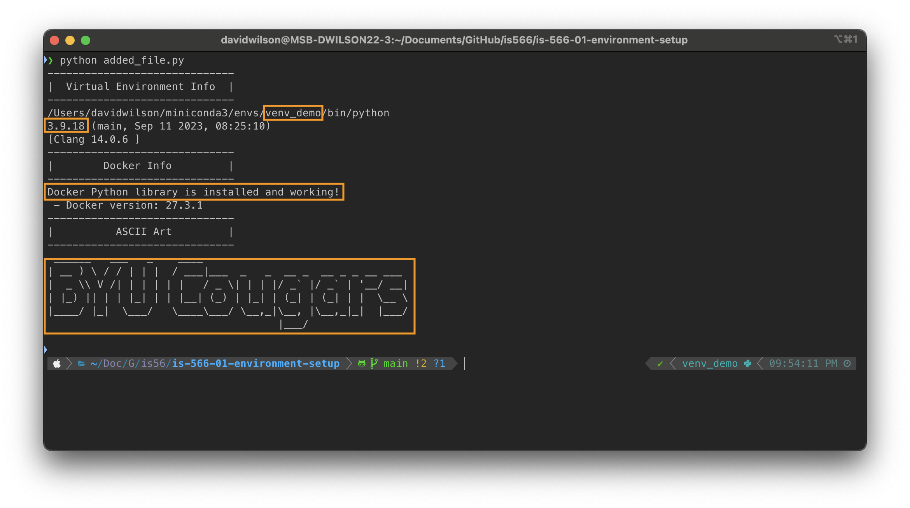

[](https://classroom.github.com/a/tIwdPwOw)
# GitHub Classroom and Environment Setup Assignment

The goal of this assignment is to introduce you to using GitHub Classroom for assignments, and to ensure that you have all of the utilities and technologies installed on your machine that we'll be using this semester. 

## Technologies Other than Git(Hub)

We'll walk through Github and GitHub classroom below, but first, let's make sure you are prepared to use all of the other technologies we'll be using this semester. Data engineering is a broad discipline that requires you to touch a lot of different tools, so you'll be using a variety of other technologies throughout the semester. Many of these will be familiar to you from prior classes you've used, but I'm going to list them below, along with a few resources for you to check out if you feel like you need a refresher (or a crash course if any of them are completely new to you).

- **Linux/shell**: Many cloud technologies are most conveniently (or exclusively) manipulated using a Linux-based command shell. You don't need to be a shell expert, but you should understand the basics of how to navigate a file structure, execute commands with option flags, as well as how to install packages with package managers like `apt-get`.
  - Resources: [Linux for Beginners from Ubuntu (text)](https://ubuntu.com/tutorials/command-line-for-beginners#1-overview), [60 Linux Commands you NEED to know (10:49)](https://www.youtube.com/watch?v=gd7BXuUQ91w), [Linux Command Line for Beginners (59:24)](https://www.youtube.com/watch?v=16d2lHc0Pe8), [Beginner's Guide To The Linux Terminal (42:26)](https://www.youtube.com/watch?v=s3ii48qYBxA)
  - **Note for Windows Users**: Many of the (local) command line operations we accomplish in class can be done using the Windows Powershell, but I won't be able to support you very well if you run into trouble. Any cloud service that you interact with via the Shell will be Linux as well. Therefore, I recommend installing and configuring the Windows Subsystem for Linux (WSL). This can be easily accomplished with a few commands in Powershell, and you can follow [this set of instructions](https://learn.microsoft.com/en-us/windows/wsl/install) from Microsoft to do so.
- **Python Virtual Environments**: Pretty much everyone will have used python for something before this class, but you may not have done as much with virtual environments. Virtual environments provide a handy way to manage the set of supporting libraries required for a particular use case. I'm going to recommend that we set up different virtual environments for some assignments, so you should be familiar with what these are and how they are used.
  - _Bonus tip_: I personally like to use [Miniconda](https://docs.anaconda.com/miniconda/) (a much smaller version of [Anaconda](https://docs.anaconda.com/)) to manage my python virtual environments and their various package libraries.
  - Resources: [The definitive guide to Python virtual environments with conda (text)](https://www.whiteboxml.com/en/blog/the-definitive-guide-to-python-virtual-environments-with-conda), [Python Virtual Environments: A Primer (text)](https://realpython.com/python-virtual-environments-a-primer/)
- **Docker**: Docker containers are an elegant way to manage a lot of complexity in the data engineering world. We'll use Docker quite a lot to setup (local) environments that mimic the services we would pay to use on a cloud platform. Don't worry if you don't feel like an expert with this one--we'll do a full Docker assignment early in the semester to make sure everyone is up to speed. For now, just make sure that you have installed Docker on your machine and that it runs. You can download the latest version [here](https://docs.docker.com/get-started/get-docker/).
  - Resources: [Docker for Beginners (text)](https://docker-curriculum.com/), [Docker.com's Docker 101 (text)](https://www.docker.com/101-tutorial/), [Getting Started with Docker (1:07:38)](https://www.youtube.com/watch?v=pg19Z8LL06w)
- **Visual Studio Code**: You are welcome to use whatever editor or IDE you're comfortable with, but you can't go wrong with the powerful (and highly extensible) [VS Code](https://code.visualstudio.com/download) from Microsoft. It has great plugins for Python, Docker, Snowflake, git, and pretty much everything else your heart desires.

Hopefully the list above was helpful. If anything in that list was completely new and if you feel like you want a bit more practice or familiarity beyond the resources I listed, _please_ reach out to me. 

## Background on GitHub Classroom

GitHub Classroom is a tool that helps me organize and manage GitHub repositories that are used for class assignments and group project deliverable. GitHub Classroom automates repository creation and access control, making it easy to distribute starter code and collect assignments on GitHub.

A GitHub Classroom assignment is a GitHub repository with access control setup so both you and your instructor can access it. When you accept an assignment, GitHub Classroom will automatically create a new, personalized copy of the assignment repository for you. The assignment repository will belong to your course's organization account on GitHub, but you and your teacher will have access to it.

Once an assignment has been accepted, students no longer interact with GitHub classroom. They just interact with GitHub.

### Git and GitHub Desktop

In order to complete most assignments for this course, you will need to be able to use git and be familiar with GitHub. If you join a data science (or any engineering) team someday, you'll almost certainly do most of your work in code, and you'll likely collaborate with your team via git and GitHub.

You probably already have experience with these tools from prior classes, but just in case, I'd encourage you to watch [this excellent tutorial video](https://www.youtube.com/watch?v=8Dd7KRpKeaE) that summarizes git, GitHub, and GitHub Desktop. It's 22 minutes long, but it's clear and comprehensive (and you can up the playback speed if you want).

### Terms to Know

While you're watching the video above and playing with git/GitHub for this assignment, be sure that you are familiar with the following terms. You need to know them to be successful in completing and submitting assignments. If you can't explain these terms to a friend, I suggest doing some additional research online until you're comfortable with them.

- (Understand the difference between git, GitHub, and GitHub Desktop)
- Repository
- Branch
- Clone
- Add
- Commit
- `.gitignore`
- Push
- Pull
- Publish
- Pull Request
- Merge

### Git Utilities

There are dozens of great git tools that allow you to use git and GitHub, ranging from the command line `git` tool (for the hardcore among you), to GUI tools like GitHub's own GitHub Desktop, to plugins for most common code editors through which you can add, commit, branch, and push/pull files from within your IDE.

If you have a favorite tool, you're welcome to use it. If you don't, **I'd recommend using GitHub Desktop** this semester. It's available (free) for both Mac and Windows, it's built by GitHub, and it's fully capable of doing everything you'll need to do this semester. The (minor) disadvantage is that it's a separate application, but it's not a huge inconvenience. [Download GitHub Desktop here](https://desktop.github.com).

---
## Assignment Instructions

**Important:** The following instructions assume that you've already created a GitHub account (if necessary), accepted the first assignment using the link from the course schedule in Learning Suite, and properly linked your GitHub account with your name from the roster. 

**Also Important:** If you get stuck on any of the steps below, it's important that you reach out to a TA or me so we can help you get comfortable with everything happening in this assignment. 

1. Clone your assignment repository to your local machine. The easiest way to do this is from the web interface. On the main "Code" tab, there is an attractive green "Code" button, which drops down to provide several options for cloning. Assuming you're using GitHub desktop, just use the "Open with GitHub Desktop" option and you'll hopefully be redirected to the GitHub Desktop app with the details pre-populated. If that doesn't work, you can also copy the provided `https` URL and then use GitHub Desktop to manually clone the repository with that URL.

2. Head to VS Code (or your IDE of choice) and ensure that you can see your newly cloned repository there.

3. Open the `editme.txt` file and add a sentence about a podcast that you enjoy listening to and why.

4. When you have finished editing the file, save the changes and commit them to your repository, adding an appropriate commit message.

5. Create a new python virtual environment called `venv_demo` using python version 3.9.18. Ensure that a two python libraries are installed in that environment: `pyfiglet` and `docker`.

6. Create a new python script file called `added_file.py` and save it to this repository. Add the block of code below to the file. (Note that if you are viewing this file as a raw text/markdown file, you'll see three "tick" marks before and after the code block below. These tick marks should not be copied into the `added_file.py` script.) After pasting the code below, save the file.

```
import pyfiglet
import sys
import docker

print('------------------------------')
print('|  Virtual Environment Info  |')
print('------------------------------')
print(sys.executable)
print(sys.version)

print('------------------------------')
print('|        Docker Info         |')
print('------------------------------')
try:
    client = docker.from_env()
    info = client.info()
    print("Docker Python library is installed and working!")
    print(f" - Docker version: {info.get('ServerVersion')}")
except Exception as e:
    print("An error occurred while testing the Docker library:")
    print(e)

print('------------------------------')
print('|          ASCII Art         |')
print('------------------------------')
print(pyfiglet.figlet_format("BYU Cougars"))
```

7. From the linux shell, activate the `venv_demo` virtual environment you just created. Navigate to this assignment's repository folder on your local disk and run the command below _exactly as it is written_. 

    > `python added_file.py`

8. If you have properly created the `venv_demo` environment, installed the `pyfiglet` and `docker` libraries within that environment, and activated the environment prior to running the command above, you should see something very similar to the output in the image below. (Pay attention to the text within the four orange highlights.) 



9. When your output matches the example above, take a screenshot of your terminal window and save the screenshot as `terminal.png` in the assignment repository. Include that image and the `added_file.py` in a new commit, adding an appropriate commit message.

> [!TIP]
> Just to be sure, before you push your changes in the next step, your local folder should contain at least the following files: `added_file.py`, `editme.txt`, and `README.md`.

10. **Most importantly**, make sure to **push your changes** to GitHub, probably using the "Push Origin" button in GitHub Desktop. _This is how you submit your assignment._ If you don't, we can't see them and give you credit. I'll try to remind you to do this at the end of each assignment, but you'll be responsible for submitting your code using GitHub for all assignments distributed this way.

That's it! Adding changes to files or adding new files to repositories like this will be the way that all code-related assignments are submitted for the semester. That wasn't so bad, right?!?

---

## Complete the Self-Grading Survey

After you're all done with the steps above, don't forget to give yourself credit! Included in this assignment repository is a grading rubric, which you can use to evaluate whether you completed each portion of the assignment as intended. The Google Forms link at the top of the rubric corresponds with the grading items highlighted in the rubric. Answer those questions honestly, and then submit the form.